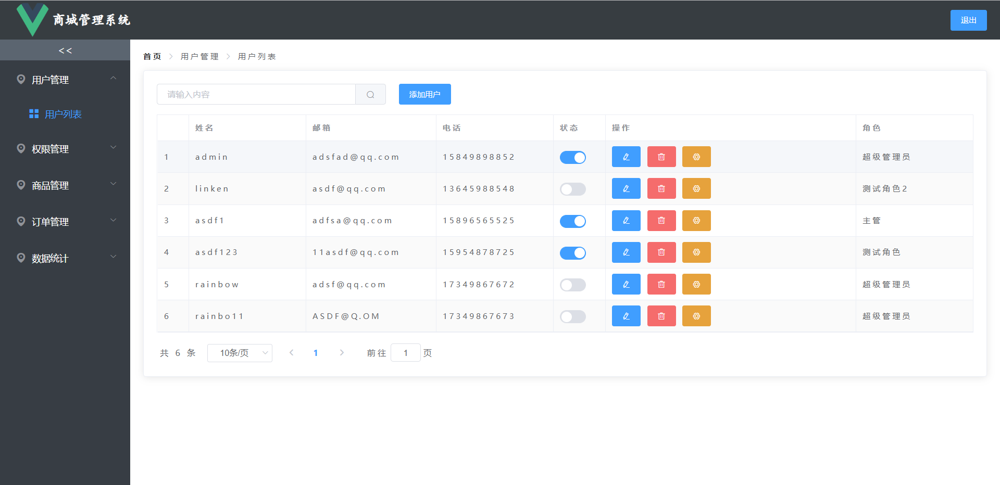
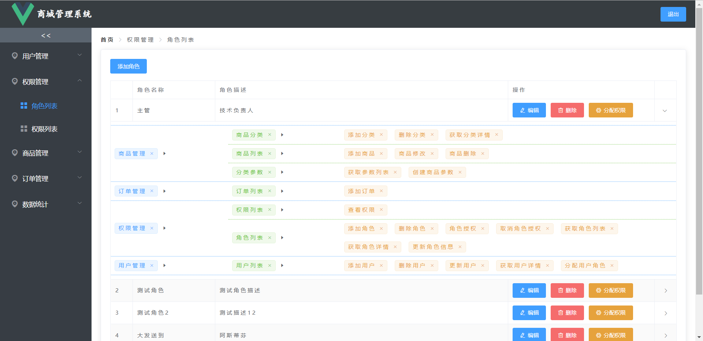
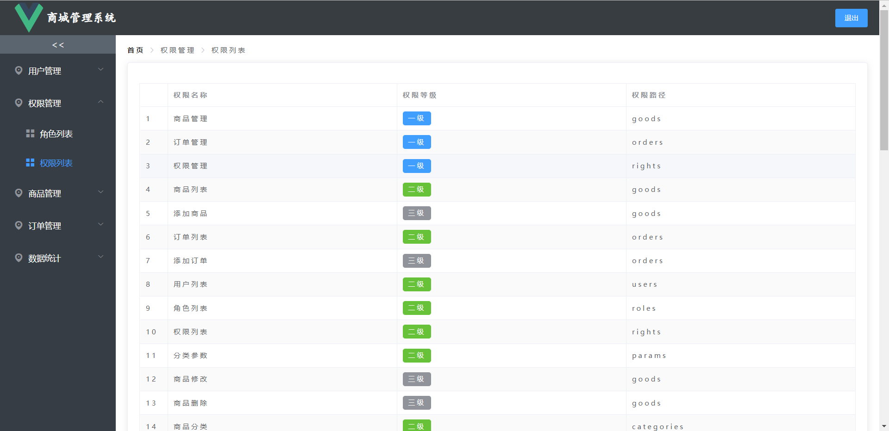
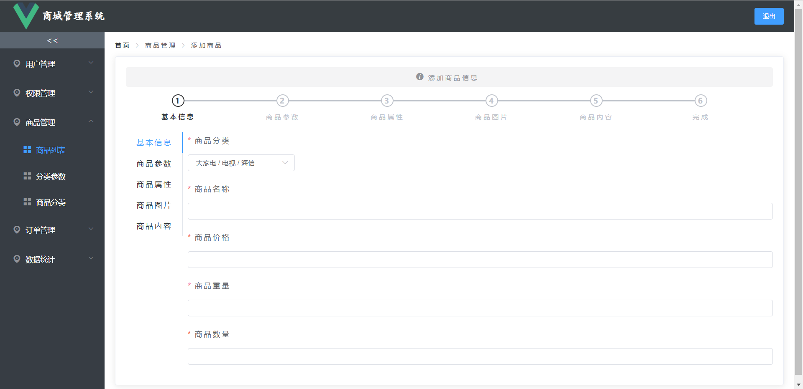
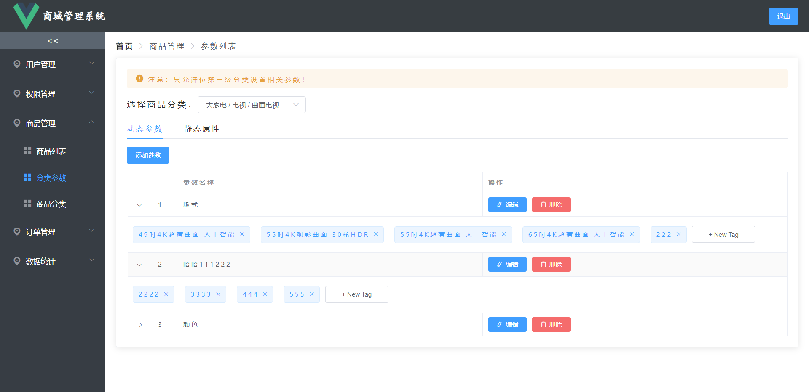
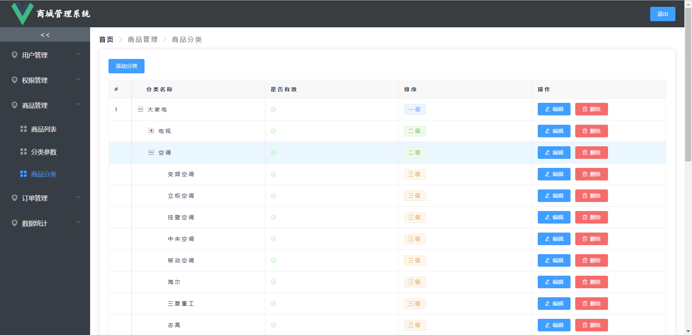
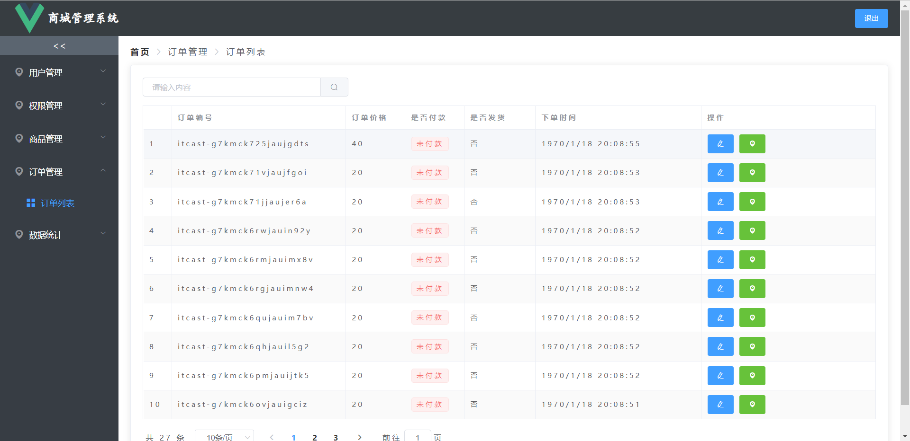
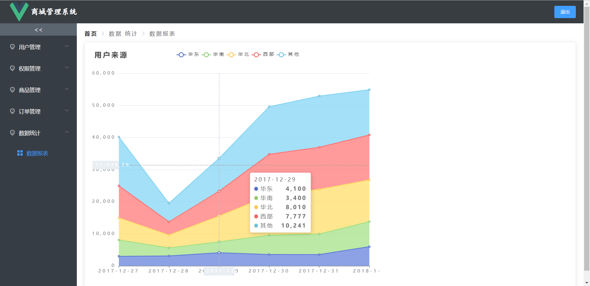
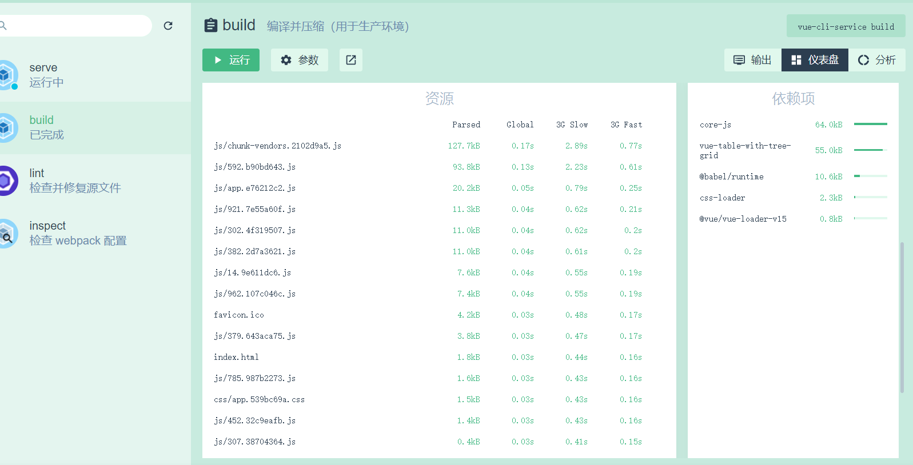

# vue_shop

## Project setup
```
npm install
```

### Compiles and hot-reloads for development
```
npm run serve
```

### Compiles and minifies for production
```
npm run build
```
### 目前项目做了，功能都基本实现了，截个图








### 项目优化之后，首页加载快了不少

### Customize configuration
See [Configuration Reference](https://cli.vuejs.org/config/).
